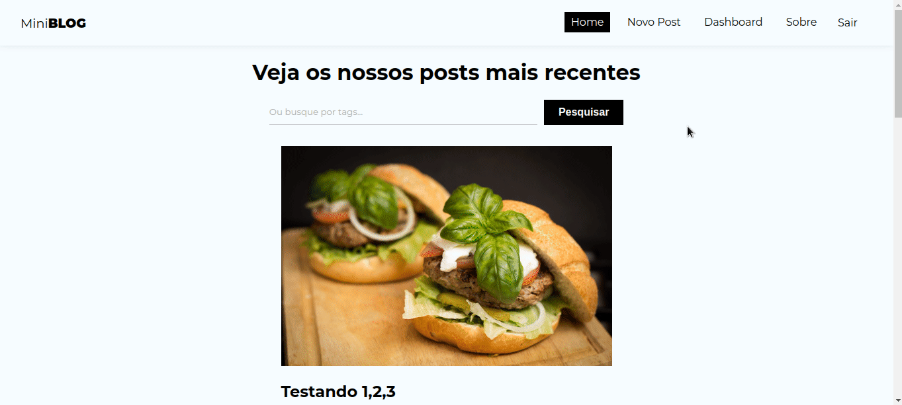

<h1>Projeto miniBlog</h1>

Este projeto foi desenvolvido em React, durante o curso de React da plataforma Udemy, sob as instruções do <a href="https://www.udemy.com/user/matheus-battisti/?gclid=Cj0KCQiA8aOeBhCWARIsANRFrQG_L_muRLSl42Kds4DNZsmK04oMrGvLAdrpcBRHR8MovYXr_OKqnrcaAmZJEALw_wcB">Matheus Battisti</a>.

Esta aplicação é uma simulação de um blog, onde é possível criar uma conta, fazer login, ver os posts de outras pessoas, é possível criar, ver, editar e deletar posts(CRUD). Nesta aplicação também foi utilizado o Cloud Firestore para armazenagem de dados e para autenticação de usuários. 

    <h4>Home da aplicação</h4>
    

 

     <h4>Cadastro</h4>
    

    <h4>Login</h4>
    

    <h4>Postagem de conteúdo (CRUD)</h4>
    

    <h4>Ver e Editar Post(CRUD)</h4>
    

    <h4>Deletar post(CRUD)</h4>
    

    <h4>busca de conteúdo</h4>
    

#### Scripts

Para baixar as dependências do projeto:

#### `npm install`

Para rodar o projeto:

#### `npm start`